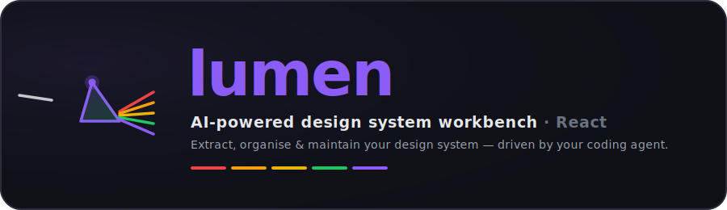

<p align="center">
  
</p>

<p align="center">
  <a href="https://www.npmjs.com/package/@icydotdev/lumen"></a>
  
  
</p>

<p align="center">
  <b>The AI-powered design system workbench for React.</b><br/>
  Point your coding agent at a codebase and Lumen extracts the design system
  already hiding in it — then helps you organise, test, and maintain it, live.
</p>

---

Most React apps already <i>have</i> a design system — it's just scattered across
components as repeated colours, ad-hoc spacing, and near-duplicate buttons. Lumen
makes it explicit: your AI agent (Claude) scans the code while the **Lumen
dashboard** visualises it in realtime, then scaffolds a structured `ui/` folder —
unified components, typed tokens, Storybook stories, and accessibility + unit
tests — and flags the inconsistencies it unified along the way.

The agent does the thinking; Lumen is the engine + live dashboard that drives and
visualises it. Part of the [@icydotdev](https://github.com/icydotdev) suite,
alongside [`runny`](https://github.com/icydotdev/runny) and
[`nextmap`](https://github.com/icydotdev/nextmap).

## Usage

Lumen is the **engine** behind the `react-design-system-extractor` skill. You normally
drive it through the skill, not by hand:

```bash
# once — installs the skill (prompts for project vs global)
npx skills add icydotdev/skills --skill react-design-system-extractor
```

Then, in Claude Code (or any supported agent):

```
/react-design-system-extractor
```

The skill runs the Lumen engine, scans your codebase, and scaffolds `ui/` while
the dashboard visualises it live. Claude is the AI layer — no API key required.

### Running the engine directly

```bash
npx @icydotdev/lumen --serve       # dashboard + ingest API, for an AI to drive
npx @icydotdev/lumen --dashboard   # ongoing dashboard for an already-scaffolded project
npx @icydotdev/lumen --fallback    # deterministic scaffold, no AI (TODO stubs)
```

After a run, a `lumen` script is added to your `package.json`:

```bash
npm run lumen
```

## Options

```
Usage: lumen [options]

  --dashboard       Launch dashboard only (no scaffolding), for ongoing use
  --no-browser      Don't open the browser automatically
  --port <number>   Port to run on (default: 3719)
  --dry-run         Show what would be generated without writing files
  -h, --help        Show this help message
```

## What gets generated

```
ui/
├── components/
│   └── Button/
│       ├── Button.tsx           # Unified component with variant props
│       ├── Button.stories.tsx   # Storybook stories, one per variant
│       ├── Button.test.tsx      # Unit tests + a11y (axe-core)
│       └── index.ts             # Re-export
├── theme.ts                     # Typed token exports
├── tokens.ts                    # Raw inferred token values
├── lib/cn.ts                    # className combiner (Tailwind path)
└── lumen.config.ts             # Config for future runs
```

Lumen is **additive by default** — `ui/` is always net-new and existing files
are never modified without showing a diff first.

## Supported styling approaches

Detection is non-exclusive; a project may use several.

| Approach          | Detection signal                                   |
| ----------------- | -------------------------------------------------- |
| Tailwind          | `tailwind.config.*` exists                         |
| CSS Modules       | `.module.css` / `.module.scss` files present       |
| Styled Components | `styled-components` in dependencies                |

> **v1 constraint:** Tailwind + React is the primary, best-supported target.
> CSS Modules and Styled Components are detected and respected but produce
> less polished output for now.

## How the AI layer works

When invoked via `claude -- npx @icydotdev/lumen`, Claude Code names tokens from
usage context, clusters similar components into unified variants, and writes
idiomatic components, stories, and behaviour-focused tests. Without Claude Code,
Lumen still produces structural scaffolding with generic token names and TODO
placeholders — useful, but less polished.

## Development

```bash
npm install
npm run dev      # server (tsx watch) + client (vite) concurrently
npm run build    # build client (vite) + server (tsc)
```

## License

MIT © Sam Kavanagh
